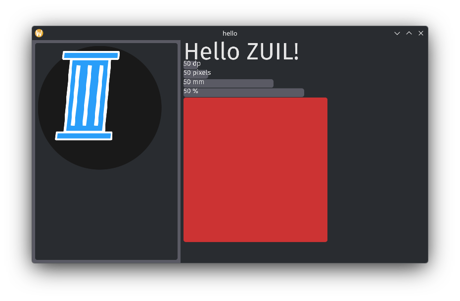

<h1 align="center">
<sub>

</sub>
ZUIL
</h1>

> [!CAUTION]
> WIP

> [!IMPORTANT]
> not tested on windows\
> and the `build.zig` links some libraries as system libraries\
> which i assume doesnt work on windows

---

ZUIL (Zig UI Library)

basic ui framework made with zig\
using `zglfw`, `zopengl`, `plutosvg`/`plutovg` and `freetype` (no text rendering yet)

the `include` directory has headers for `plutosvg`/`plutovg` instead of using the system installed headers mainly to stop zls from giving false errors

---



> container, list(row/column) and icon widgets

## features

- modular widget system
- asset and shader registries/managers
- bitmap rendering (currently used by icons only)
- input system (keyboard and mouse only) (WIP)

### missing

- text rendering
- more optimized rendering
- rendering abstraction (currently widgets directly use opengl)
- and more

## example

> test/example project: `test/`\
> run with `./test.sh`

widgets are created using builder functions (the functions will probably change in the future)

```zig
widgets.container()
.size(.{.dp = 1200}, .{.percentage = 1})
.color(colors.WHITE)
.child(
	widgets.container()
	.layout(.fill)
	.margin(.{.dp = 5}, .{.dp = 5}, .{.dp = 5}, .{.dp = 5})
	.color(colors.rgb(0, 1.0, 0.5))
	.build()
)
.build();
```

## technical info

window processing order/logic

1. process input from queue
   1. send to global input handler
   2. if input was let through
      - send keyboard input to focused widget
      - send mouse input to hovered widget
2. if the windows layout is marked dirty check
   - if root widgets layout is dirty then recalculate the whole tree
   - if root widget is not dirty go down a step with no recalculation
     - if a child widget is dirty recalculate layout from that widget down
     - else continue doing down
3. if the windows render is marked dirty
   - render entire widget tree (the plan is to only render widgets inside a dirty area)
