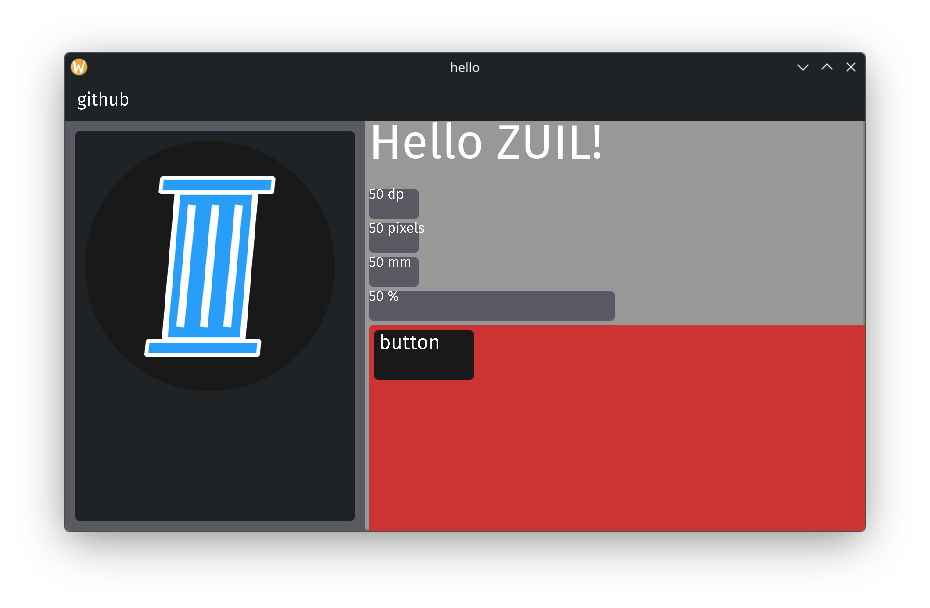

<h1 align="center">
<sub>

</sub>
ZUIL
</h1>

> [!CAUTION]
> WIP

> [!IMPORTANT]
> NOT TESTED ON WINDOWS\
> the `build.zig` links some libraries as system libraries\
> which i assume doesnt work on windows

---

ZUIL (Zig UI Library)

retained mode gui framework written in zig

using `sdl3`, `zopengl`, `plutosvg`, `harfbuzz` and `freetype` libs

---



### current plan

usage (with app module):
1. core
   1. init asset registry
   2. init theme
2. app
   1. init app module
3. widgets
   1. register widget lib context
   2. register style to theme
4. user
   1. register assets
   2. init widget tree
   3. init window
5. app
   1. app run

rendering:\
replace renderer with a painter interface system and allow casting to the actual backend if its a know type for more advanced stuff

## examples

### widgets

widgets are created using builder functions

```zig
// .c for common builder functions
widgets.container()
.c.size(.{.dp = 1200}, .{.percentage = 1})
.color(colors.WHITE)
.child(
	widgets.list()
	.c.size(.fill, .fill) // fill is same as .{.percentage = 1}
	.direction(.vertical)
	.spacing(1)
	.children(.{
		widgets.icon()
		.c.size(.{.dp = 200}, .{.dp = 200})
		.c.keepSizeRatio(true)
		.icon("icon.svg")
		.build(),
		widgets.container()
		.c.size(.{.dp = 50}, .{.dp = 30})
		.c.eventCallback(containerClick) // fn (*ZWidget, *const ZEvent) callconv(.c) c_int
		.color(colors.rgb(0, 1.0, 0.5))
		.build(),
		widgets.container()
		.c.size(.{.pixel = 50}, .{.dp = 30})
		.build(),
		widgets.container()
		.c.size(.{.mm = 50}, .{.dp = 30})
		.build(),
		widgets.container()
		.c.size(.{.percentage = 0.5}, .{.dp = 30})
		.build(),
	})
	.build()
)
.build();
```

### test project

there is a test/example project in the `test` directory

keybinds:

- `space`: change the background color
- `F1`: spawn a new window (currently broken)

## project structure

directories in `src` dir:

- `core` has the base widget system
- `app` has sdl3 specific things and can be used to create windows that use the core widget system
- `widgets` has the default widgets
